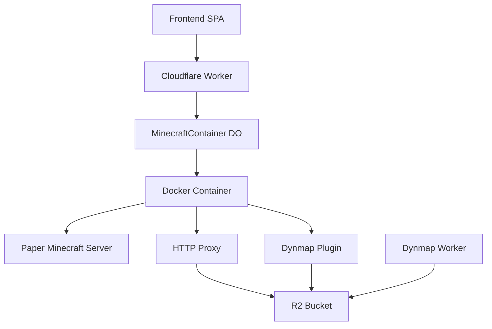

# Mineflare ⛏️☁️

[](https://deploy.workers.cloudflare.com/?url=https://github.com/eastlondoner/mineflare)

A serverless Minecraft server hosting platform built on Cloudflare's edge infrastructure. Run a fully-featured Minecraft server with real-time monitoring, authentication, and plugin management—all powered by Cloudflare Workers and Containers.

## ✨ Features

- **🚀 Serverless Infrastructure** - Built on Cloudflare Workers and Durable Objects
- **🎮 Full Minecraft Server** - Paper server with plugin support
- **🗺️ Live Map** - Integrated Dynmap with R2-backed tile storage
- **🔐 Authentication** - Secure cookie-based auth with encrypted tokens
- **💻 Web Terminal** - Real-time RCON console via WebSocket
- **🔌 Plugin Management** - Enable/disable plugins through web UI
- **💤 Auto-Sleep** - Containers sleep after 20 minutes of inactivity to save resources
- **📊 Real-time Monitoring** - Server status, player list, and performance metrics

## 🏗️ Architecture



**Core Components:**
- **Main Worker** (`src/worker.ts`) - Elysia-based API server
- **MinecraftContainer** (`src/container.ts`) - Durable Object managing server lifecycle
- **HTTP Proxy** - Custom TCP-to-HTTP bridge for R2 access from container
- **Dynmap Worker** - Separate worker serving map tiles from R2
- **Frontend** - Preact SPA with real-time updates

## 🚀 Quick Start

### Prerequisites

- [Bun](https://bun.sh) runtime
- Cloudflare account with Workers and R2 enabled
- [Alchemy](https://alchemy.sh) CLI (for deployment)

### Development

```bash
# Install dependencies
bun install

# Start development environment
bun run dev

# Frontend dev server (separate terminal)
bun run dev:spa
```

The frontend will be available at http://localhost:5173

### Deployment

```bash
# Login to Alchemy
bun run login

# Configure settings (optional)
bun run configure

# Deploy to Cloudflare
bun run deploy
```

After deployment, you'll receive URLs for:
- Main worker (API and frontend)
- Dynmap worker (map tiles)

### First-Time Setup

1. Navigate to your deployed worker URL
2. Click "Set Password" to create your admin account
3. Login with your credentials
4. Click "Start Server" to launch the Minecraft container
5. Wait 2-3 minutes for the server to fully initialize

## 🔧 Configuration

### Environment Variables

Required environment variables (set in `.env` file):

```env
# Cloudflare credentials (from Alchemy login)
CLOUDFLARE_ACCOUNT_ID=your_account_id
CLOUDFLARE_API_TOKEN=your_api_token

# Optional: Tailscale for private networking
TS_AUTHKEY=your_tailscale_key

# Optional: Alchemy password for state encryption
ALCHEMY_PASSWORD=your_secure_password
```

### Container Settings

Edit `src/container.ts` to customize:
- `sleepAfter` - Auto-sleep timeout (default: 20 minutes)
- `maxPlayers` - Maximum concurrent players
- `serverVersion` - Minecraft server version
- Plugin configurations

## 🔌 Plugin System

Mineflare supports optional Minecraft plugins that can be enabled/disabled via the web UI:

**Built-in Plugins:**
- **Dynmap** - Always enabled, provides live web-based map
- **playit.gg** - Optional tunnel service for external access

**Adding Custom Plugins:**
1. Add `.jar` file to `container_src/`
2. Define plugin spec in `PLUGIN_SPECS` (src/container.ts)
3. Rebuild and redeploy

Plugin changes require server restart to take effect.

## 🎮 Connecting to Your Server

### Option 1: Tailscale (Recommended)
Set up Tailscale VPN and connect to the server's private Tailscale IP (shown in web UI).

### Option 2: playit.gg Plugin
Enable the playit.gg plugin in the web UI to get a public tunnel address.

### Server Ports
- `25565` (or tunnel port) - Minecraft game traffic
- `8123` - Dynmap web interface (via Dynmap worker)

## 📝 API Endpoints

Key endpoints:
- `GET /api/status` - Server status and metrics
- `POST /api/auth/login` - Authenticate user
- `POST /api/auth/setup` - First-time password setup
- `GET /api/players` - List online players
- `POST /api/shutdown` - Stop server
- `GET /api/logs` - Container logs
- `WS /ws?token=<token>` - Terminal WebSocket

## 🛠️ Development Commands

```bash
# Build worker code
bun run build

# Build HTTP proxy binary
./container_src/build-proxy.sh

# Destroy deployed resources
bun run destroy

# Show Alchemy version
bun run version
```

## 📚 Documentation

- [CLAUDE.md](CLAUDE.md) - Detailed technical documentation
- [AGENTS.md](AGENTS.md) - Architecture and development guide
- [DYNMAP_PLAN.md](DYNMAP_PLAN.md) - Dynmap implementation details
- [R2_IMPLEMENTATION.md](R2_IMPLEMENTATION.md) - R2 storage integration

## 🏛️ Architecture Details

### Authentication
- Cookie-based sessions with encrypted tokens
- PBKDF2 password hashing with salt
- AES-GCM symmetric encryption
- 7-day session expiry

### Storage
- **Durable Object SQL** - Plugin state, auth credentials, symmetric keys
- **R2 Bucket** - Dynmap tiles with 12-hour lifecycle
- **Worker Cache** - Cached auth state to reduce DO wakeups

### Container Lifecycle
1. Worker calls `container.start()`
2. Docker container starts, waits for ports
3. RCON connection initializes
4. HTTP proxy connects
5. Minecraft server loads
6. Auto-sleep after 20 minutes of inactivity

## 🤝 Contributing

Contributions welcome! Please read the development documentation in [CLAUDE.md](CLAUDE.md) before submitting PRs.

## 📄 License

MIT License - see LICENSE file for details

## 🙏 Acknowledgments

- [Cloudflare Workers](https://workers.cloudflare.com) - Serverless platform
- [Alchemy](https://alchemy.sh) - Infrastructure as Code tool
- [itzg/minecraft-server](https://github.com/itzg/docker-minecraft-server) - Docker Minecraft server
- [Dynmap](https://github.com/webbukkit/dynmap) - Live mapping plugin
- [Paper](https://papermc.io) - High-performance Minecraft server

## ⚠️ Important Notes

- Container costs may apply based on usage (check Cloudflare pricing)
- R2 storage has minimal costs (generous free tier)
- Workers have generous free tier (100k requests/day)
- Container sleeps automatically to minimize costs
- First container start may take 2-3 minutes

## 📞 Support

For issues and feature requests, please use the [GitHub issue tracker](https://github.com/eastlondoner/mineflare/issues).

---

Made with ☁️ by [eastlondoner](https://github.com/eastlondoner)

